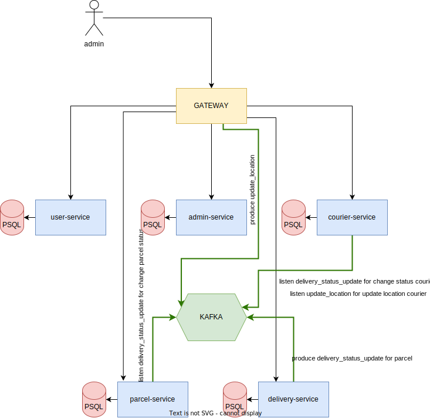

# Parcel Delivery

This microservice system is designed for Parcel Delivery software

## Run

Enter the following command inside the folder.

for windows os
```bash
docker-compose.exe up --build 
```
for linux os
```bash
docker-compose up --build 
```

## Usage

Gateway API 
* Go to http://localhost:8080/swagger-ui.html after successfull execution


## Microservice diagram


